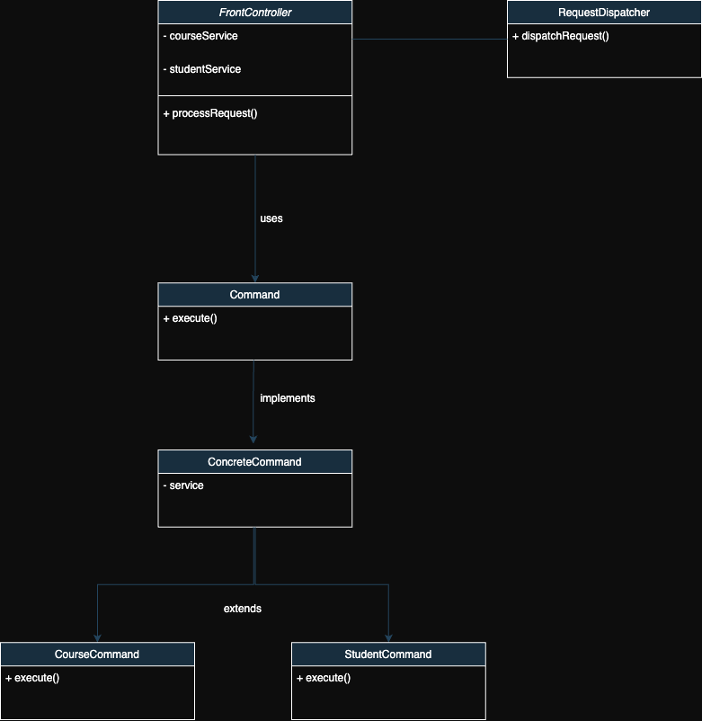
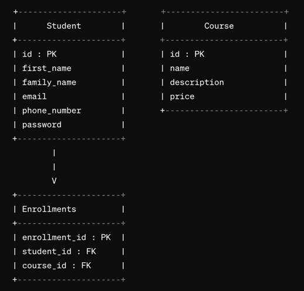

# Backend App - Student Course purchasing webapp

### System requirements:
- As a student, I should be able to register with first name, family name, email address,  phone number and a password
- As a student, I should be able to login with email address and password to see list of courses listed
- As a student, I should be able to get courses into cart and checkout to pay at the end of course selection

### Architectural requirements
- Use Java 11
- Use Java Servlet API, use only Java EE based APIs.
- Use front controller design pattern
- Use H2 db

--------------

**Let's recall what Front controller design pattern was**
>The front controller design pattern means that all requests that come for a resource in an application will be handled by a single handler and then dispatched to the appropriate handler for that type of request. The front controller may use other helpers to achieve the dispatching mechanism

[Front controller](https://www.geeksforgeeks.org/front-controller-design-pattern/)

Our UML based on front controller DP

Our DB ERD
