1. download [Tomcat](https://tomcat.apache.org/download-90.cgi) using this [link](https://dlcdn.apache.org/tomcat/tomcat-9/v9.0.85/bin/apache-tomcat-9.0.85.zip)
2. Unarchive downloaded ZIP to C:/dev folder (for example)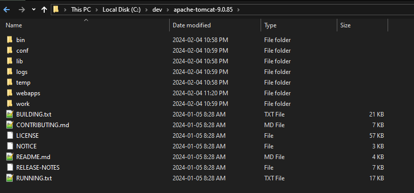
3. maven -> install 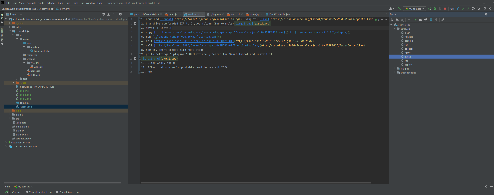
4. copy [uz.itpu.web-development-java\3-servlet-jsp\target\3-servlet-jsp-1.0-SNAPSHOT.war]() to [..\apache-tomcat-9.0.85\webapps]()
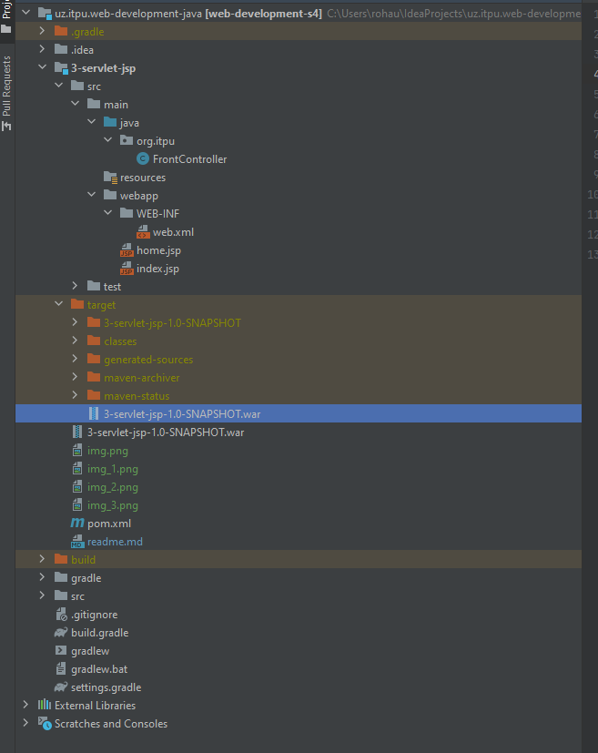 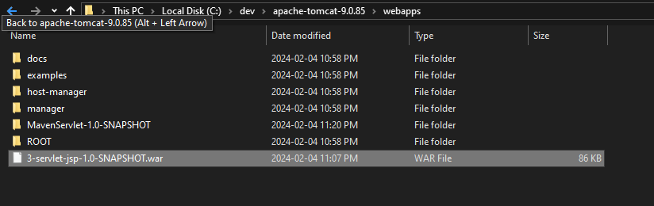
5. run [..\apache-tomcat-9.0.85\bin\startup.bat]() 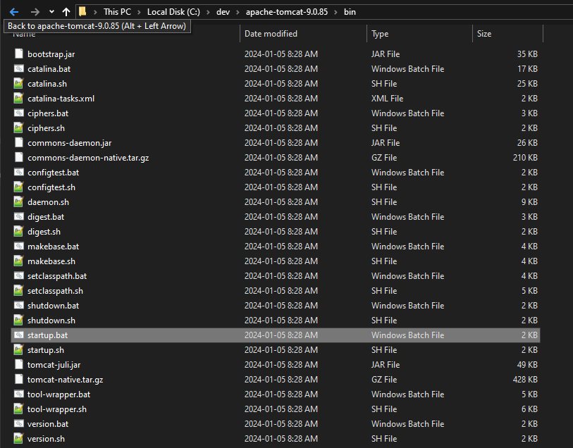 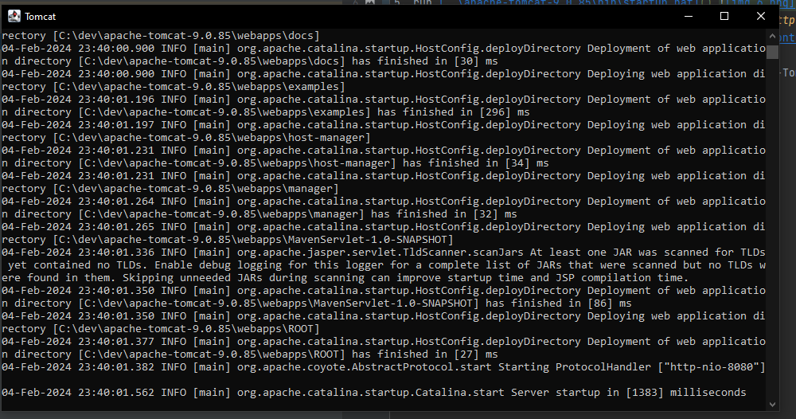
6. Notice that WAR is unarchived 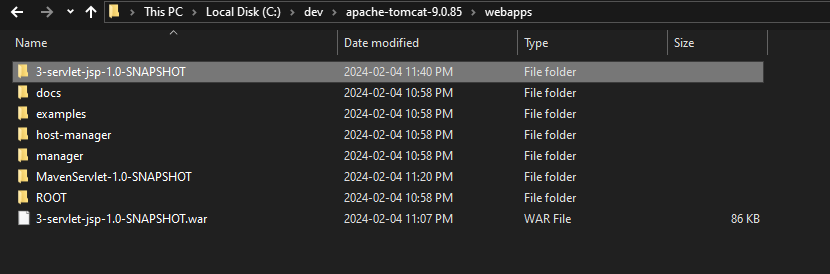
7. call [http://localhost:8080/3-servlet-jsp-1.0-SNAPSHOT](http://localhost:8080/3-servlet-jsp-1.0-SNAPSHOT)
8. call [http://localhost:8080/3-servlet-jsp-1.0-SNAPSHOT/FrontController](http://localhost:8080/3-servlet-jsp-1.0-SNAPSHOT/FrontController)
9. now try smart-tomcat with next steps
10. go to Settings \ plugins \ Marketplace \ Search for Smart Tomcat plugin and install it
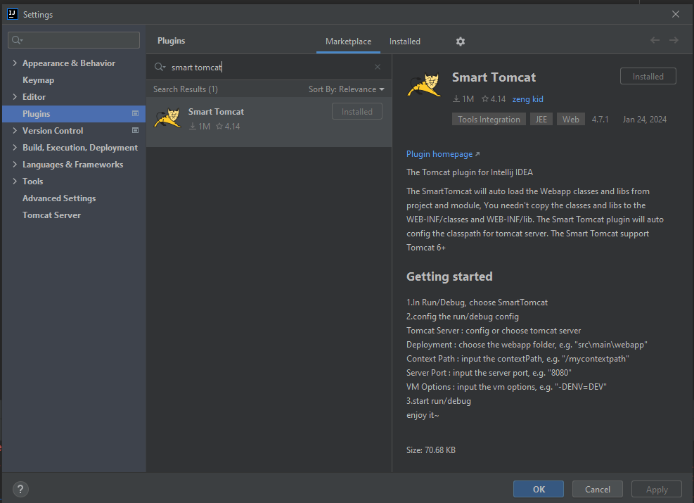 
11. Click Apply and Ok
12. After that you would probably need to restart IDEA
13. Click on Add Configuration... (top right) 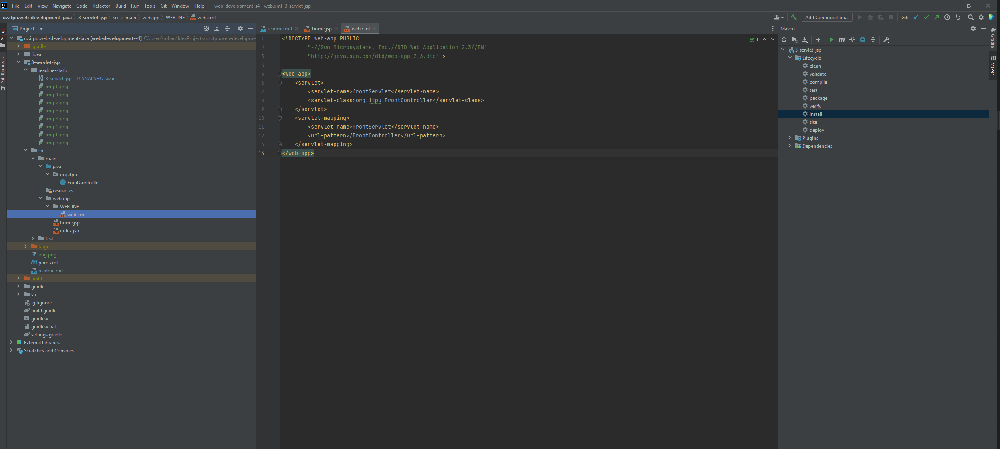
14. Add new Smart Tomcat 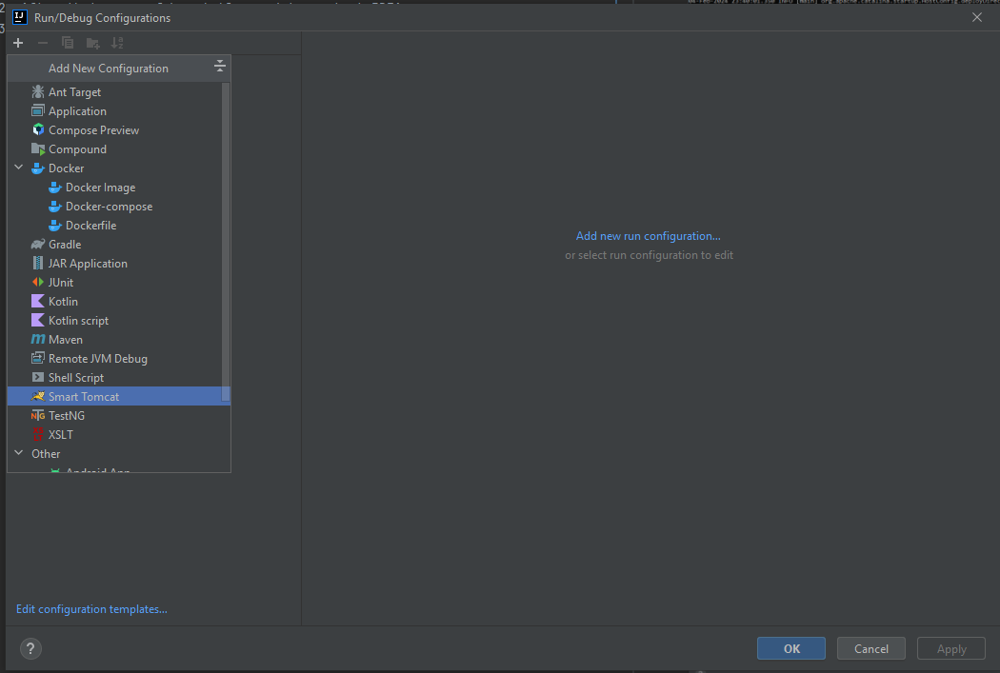
15. Set Tomcat server with your's 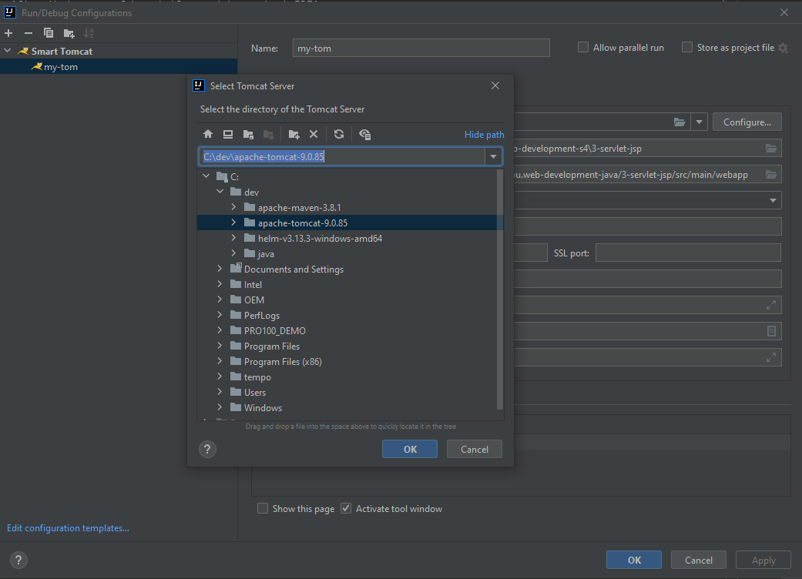
16. Name my-tom 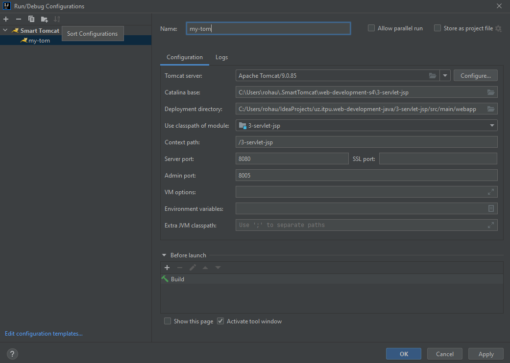
17. Apply and Ok
18. run it 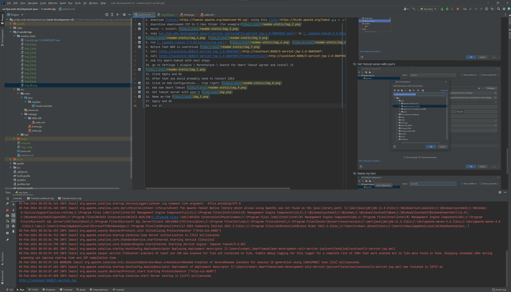
19. click on [http://localhost:8080/3-servlet-jsp](http://localhost:8080/3-servlet-jsp)
20. click on [http://localhost:8080/3-servlet-jsp/FrontController](http://localhost:8080/3-servlet-jsp/FrontController)

---
Additional
Try to run and analyze https://github.com/AndreiRohau/MavenServlet/tree/master
---

Issues:
1. /_FrontController_ not opens _home_

- Go to run configuration and add maven install in before lunch section
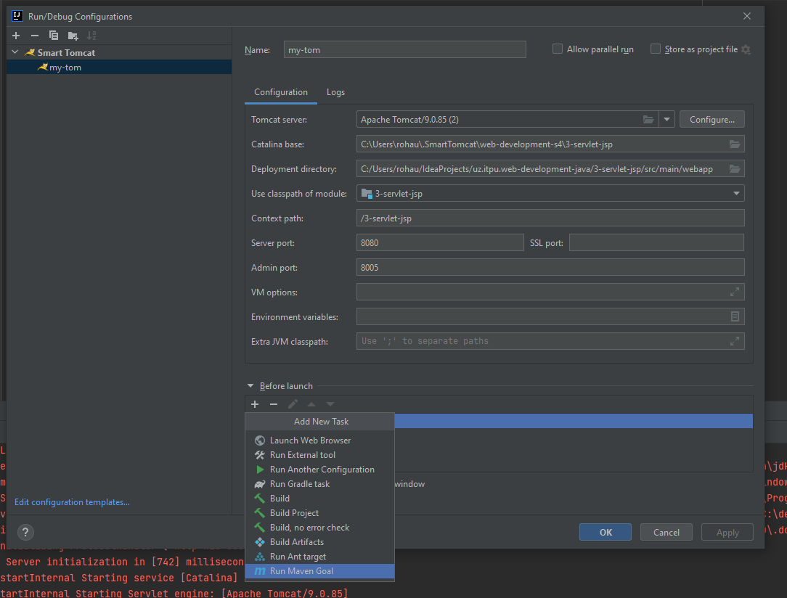
- enter "install" 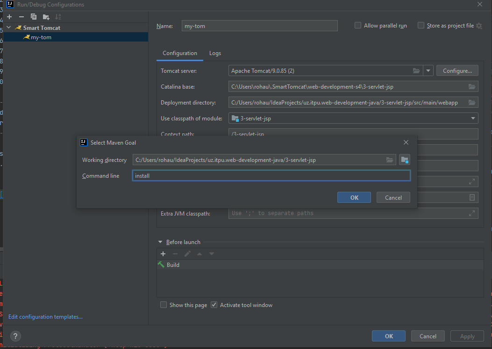 click Ok
- put maven above build 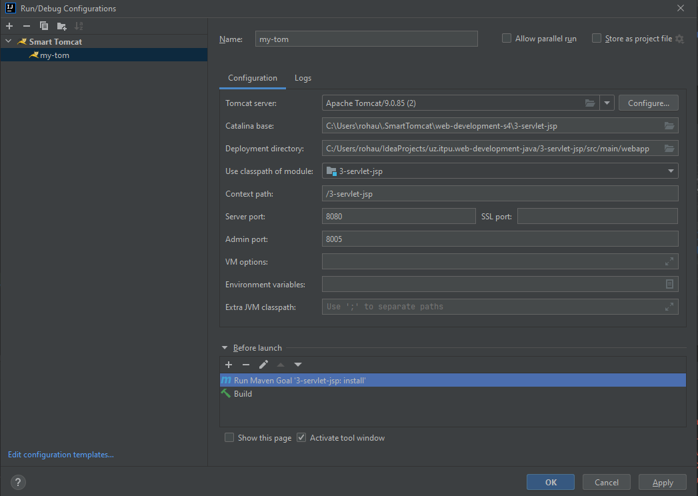
