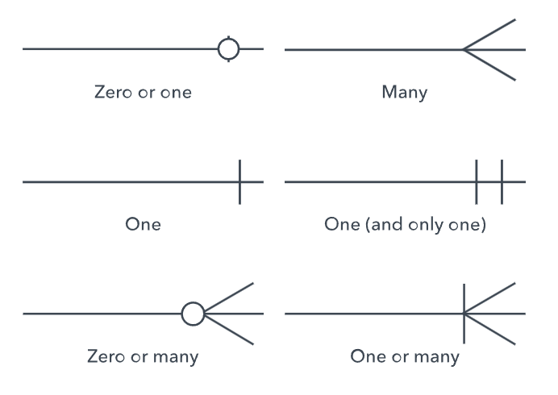
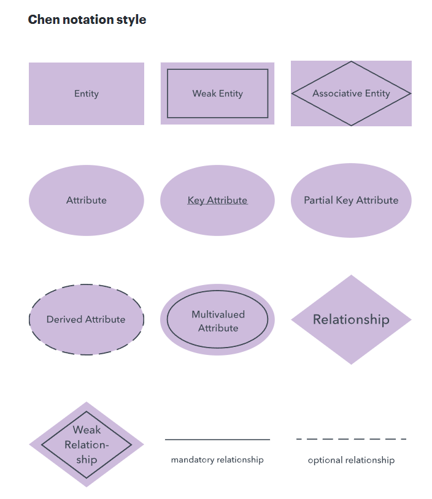
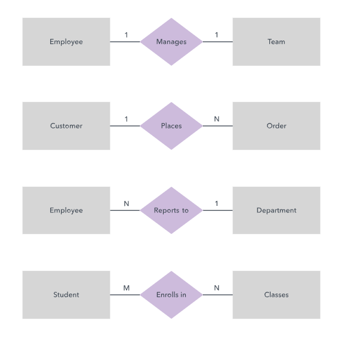
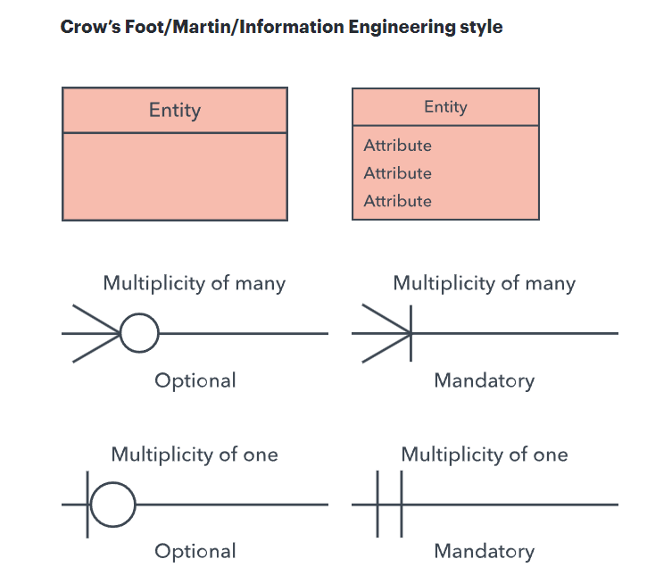
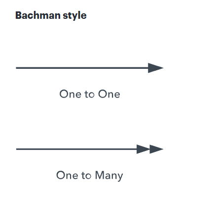
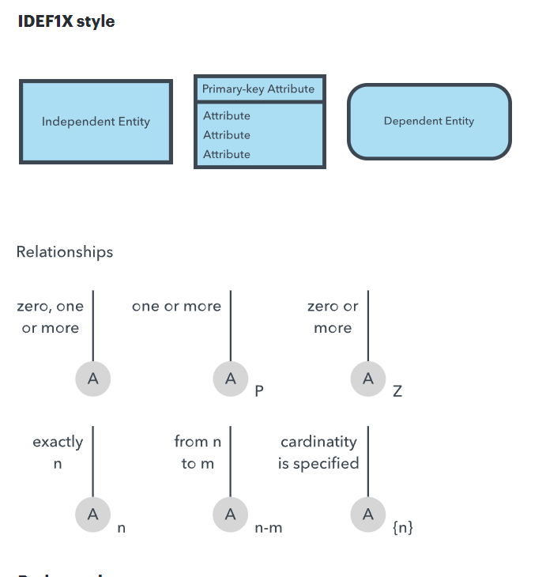
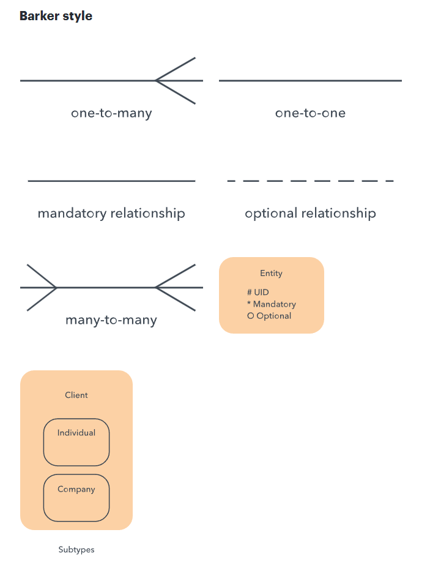
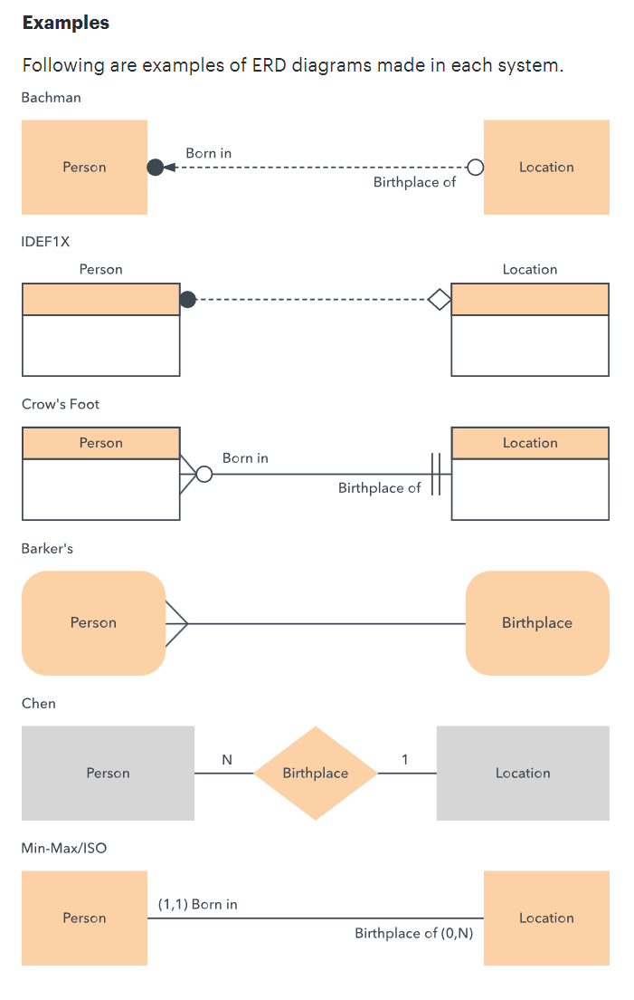
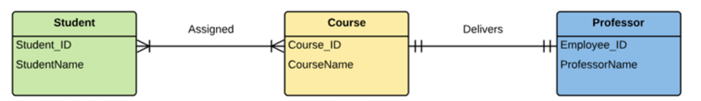
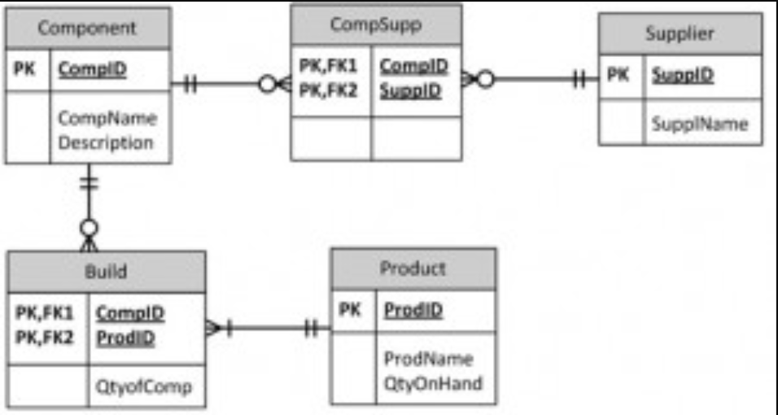

ERD
---
Find 3 exercises in the bottom of the document.
---

Note existance of different types of notations
---

Cardinality types notations
---

Notation with Cardinality
---

SUM UP
---

---
EXERCISE 1
---
University 

- In a university, a Student enrolls in Courses. 
- A student must be assigned to at least one or more Courses. 
- Each course is taught by a single Professor. 
- To maintain instruction quality, a Professor can deliver only one course

source [link](https://www.guru99.com/er-diagram-tutorial-dbms.html#how-to-create-an-entity-relationship-diagram-erd)

---
EXERCISE 2
---

Look through an example of a complicated ERD on University management system [LINK](https://vertabelo.com/blog/er-diagram-for-a-university-database/)

---
EXERCISE 3
---
Manufacturer
A manufacturing company produces products. The following product information is stored: product name, product ID and quantity on hand. These products are made up of many components. Each component can be supplied by one or more suppliers. The following component information is kept: component ID, name, description, suppliers who supply them, and products in which they are used. Use Figure B.1 for this exercise.

Create an ERD to show how you would track this information.

Show entity names, primary keys, attributes for each entity, relationships between the entities and cardinality.

Assumptions
- A supplier can exist without providing components.
- A component does not have to be associated with a supplier.
- A component does not have to be associated with a product. Not all components are used in products.
- A product cannot exist without components.

ERD Answer
- Component(CompID, CompName, Description) PK=CompID
- Product(ProdID, ProdName, QtyOnHand) PK=ProdID
- Supplier(SuppID, SuppName) PK = SuppID
- CompSupp(CompID, SuppID) PK = CompID, SuppID
- Build(CompID, ProdID, QtyOfComp) PK= CompID, ProdID

Diagram
---

source [link](https://opentextbc.ca/dbdesign01/back-matter/appendix-b-erd-exercises/)

