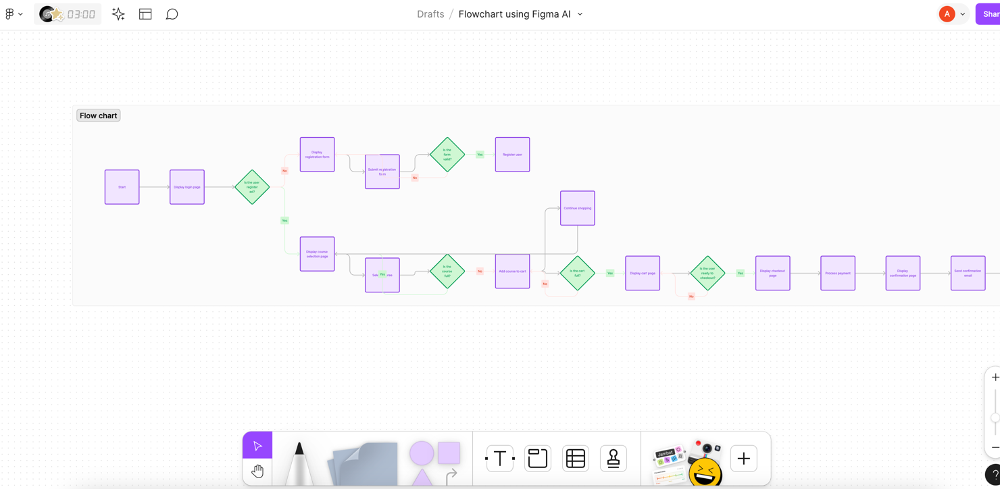
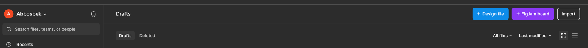

Flowchart and simple UI for Student Course (Udemy) website
---

Flowchart using AI
https://www.figma.com/file/SABpSqSkoa8Kj36pHleF4M/Flowchart-using-Figma-AI?type=whiteboard&node-id=1%3A2&t=4gtiImrVA21PjY3b-1
---

Press design a new file
---

Step 1. Define the purpose of your application. How will it be useful for future users?

Step 2. Clarify the users' objectives. Why will the users want to use your app? Once they have launched the application, what will they be looking for in the first place? Secondly? Define a basic scenario and an advanced one.

Step 3. Identify the most important elements and content for the users. How will you place it on the page?
Create a set of schematic wireframes.
https://www.figma.com/file/0UANdYk38CJ6YsreEHgZ3O/Wireframing-in-Figma?type=design&mode=design&t=4gtiImrVA21PjY3b-1

Step 4. Develop a mockup – a static representation of your app. Add shapes, fonts, colors, and navigations.

https://www.figma.com/file/nujPybu7FJvP0be0sBGBST/Simple-UI?type=design&node-id=0%3A1&mode=design&t=m7PJ5GevCDX1cNy9-1
What kind of mistakes does the mackup have?

Step 5. Create an interactive prototype based on the mockup. The prototype should reflect the actions and their results depending on the basic use case scenario.

Step 6. Test your prototype and implement changes.

Step 7. Transfer your prototype to an HTML/JS version. It should be possible to open it in any web browser without errors or overlaps and to complete both basic and advanced scenarios.

